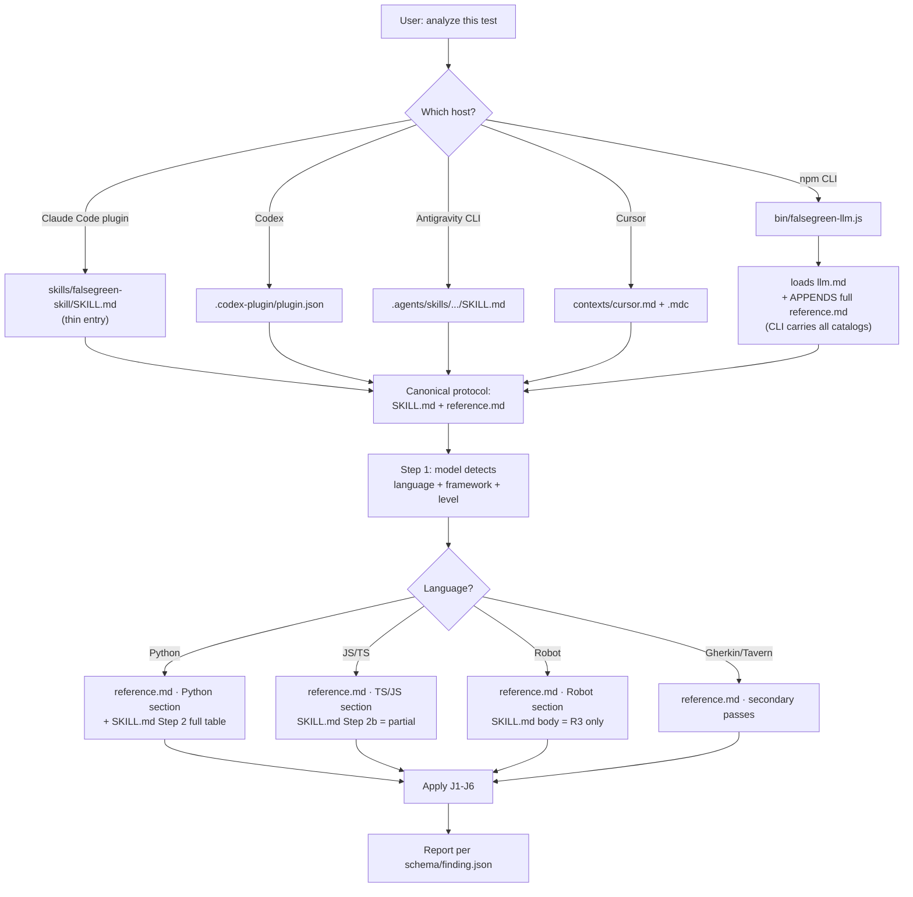
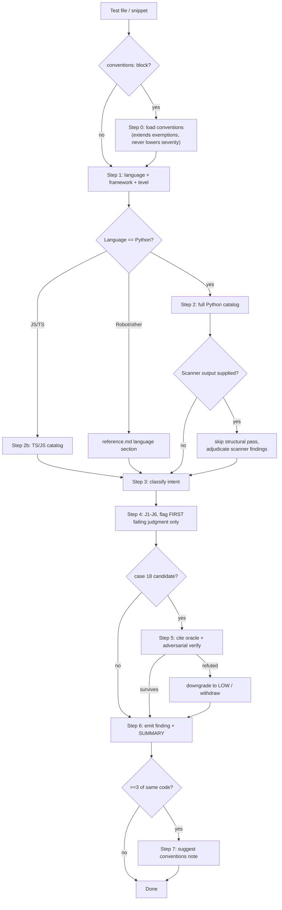
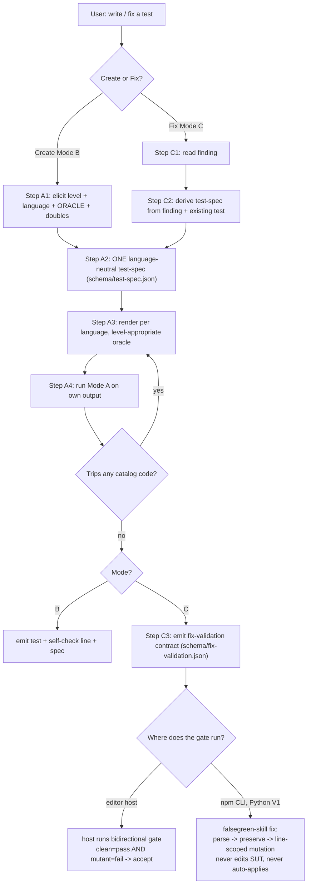
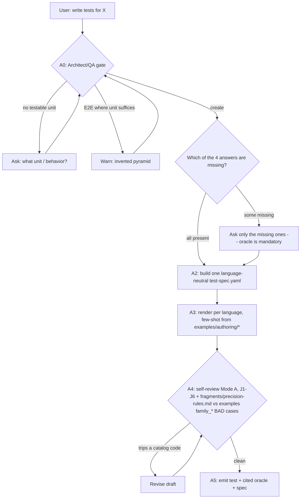

# Architecture and flow diagrams

This page is the visual companion to the root [`ARCHITECTURE.md`](../ARCHITECTURE.md).
It shows how a request routes from any host to the same protocol, and traces the
three modes the skill runs in: review (Mode A), authoring (Mode B), and fix
(Mode C). Every box maps to a real asset or a real step; the prose after each
diagram cites where in the code or the protocol it lives.

## The shape of the system

There is no parser here. The engine is a protocol the model follows, defined
once in [`SKILL.md`](../SKILL.md) and referenced by thin host entry points. The
per-language catalog and the look-alike exemptions live in
[`reference.md`](../reference.md); the JSON output contract lives in
[`schema/finding.json`](../schema/finding.json) and
[`schema/report.json`](../schema/report.json).

Four properties hold the design together, and the diagrams below make each one
visible:

- **Thin entry points, one canonical protocol.** A Claude, Codex, Gemini, or
  Cursor host file references `SKILL.md` instead of copying the catalog, so the
  judgment logic cannot drift between hosts. Diagram 1 shows the routing.
- **Four languages, three modes.** Python, TypeScript, JavaScript, and Robot
  Framework, each run through review, authoring, or fix. Gherkin and Tavern are
  covered as secondary passes in `reference.md`.
- **Superset of the static scanners.** The catalog in `reference.md` carries
  every structural code from `falsegreen` (Python), `falsegreen-js` (JS/TS), and
  `robotframework-falsegreen` (Robot), plus the AI-only S-series semantic codes.
  A CI coverage guard (`scripts/check-scanner-coverage.mjs`, run by
  `npm run validate`) fails the build if a scanner code is missing from the
  catalog, so the superset stays whole.
- **Precision first.** Findings are gated by six judgments (J1-J6), and the skill
  flags only the first judgment that fails. A false positive is treated as worse
  than a miss: a noisy pass trains people to dismiss it, which defeats the point.

## Diagram 1 - Host and language resolution

How a review request reaches the canonical protocol from each host, and how the
model then narrows to the right language section of the catalog.

Each host contributes only packaging metadata and a pointer. The Claude Code and
Codex plugins share the same entry point under `skills/falsegreen-skill/`; the
Gemini extension and the Cursor rules point at the same protocol; all of them
resolve to `SKILL.md` plus `reference.md`. The one host that cannot reference a
file on disk at prompt time is the npm CLI: `bin/falsegreen-llm.js` loads
`llm.md` and then appends the full `reference.md` to the system prompt
(`buildSystemPrompt`), because a single prompt has to carry every catalog it
advertises - without that append the CLI could not apply the Robot and TS/JS
codes it claims to support.

After the protocol is loaded, Step 1 detects language, framework, and test
level, and that detection selects the catalog section. Python is the only
language whose full catalog is inlined in `SKILL.md` (Step 2); TS/JS get a
partial table in Step 2b and lean on `reference.md` for the rest; Robot and the
secondary languages are covered in `reference.md`. Whatever the path, the test
is judged by the same J1-J6 and reported against the same schema.

## Diagram 2 - Detection flow (Mode A)

The review mode, Steps 0-7, including the case 18 adversarial verify and the
scanner-adjudication shortcut.

Step 0 is optional: a `conventions:` block declares project context (custom
assertion helpers, layer overrides, excluded codes). It extends the look-alike
exemptions but never lowers severity - a HIGH finding that survives the
exemptions stays HIGH. Steps 1 and 2 mirror Diagram 1: detect, then load the
right catalog. When a scanner already ran on Python, the model may skip its own
structural pass and adjudicate the scanner's findings instead, which keeps the
skill's output consistent with the deterministic scanner rather than competing
with it.

Step 3 classifies intent (spec, characterization, regression, behavior, or
scaffold), and intent can only lower a severity, never raise it. Step 4 applies
J1-J6 and flags only the first judgment that fails, so one root cause is not
reported six times. Case 18 - the expected value contradicts the intended
behavior - is the one finding that demands an independent oracle: Step 5 cites
the spec, contract, or domain rule and runs an adversarial verify. If a refuter
can mount a credible defense of the current expected value, the finding is
downgraded or withdrawn. Case 18 is never reported on gut feeling. Step 6 emits
the finding plus summary against the schema, and Step 7 (only when three or more
findings share a code) suggests a conventions note to suppress future noise.

## Diagram 3 - Authoring and fix (Modes B and C)

Create a test (Mode B) or repair a finding (Mode C). Both converge on one
language-neutral test-spec, render it, and self-review with Mode A before
emitting.

Authoring has no separate correctness rules: the test written in Mode B must
pass the same J1-J6 it would be judged by, so it is born non-false-green. Both
modes funnel into a single language-neutral test-spec, then render it per
language with a level-appropriate oracle, then run Mode A on their own output
and loop back if the draft trips a catalog code. Mode B emits the test with a
self-check line and its spec.

Mode C splits on where the gate runs. In an editor host, the host runs a
bidirectional gate: the strengthened test must pass on the real code and fail on
a mutant of it. On the npm CLI, the `falsegreen-skill fix` command (Python V1)
runs the deterministic gate itself - parse, preserve (the test passes on the
real system under test), then a line-scoped mutation that the test must catch.
The LLM only proposes; the gate proves. The command never edits the production
code and never auto-applies the patch, and without a runnable SUT it degrades to
propose-only and says so (`runFix` and the fix-gate in `bin/`).

## Diagram 4 - Authoring gate (Mode B, A0-A5)

**Implemented in #117/#119.** SKILL.md now opens Mode B with a named architect/QA
gate (Step A0) that runs before authoring, so the skill refuses to write a test
with no testable unit or a cited oracle it never received, and asks only the
answers that are missing. A3 renders from the `examples/authoring/` few-shots and
A4 self-reviews against `fragments/precision-rules.md` and the `family_*` BAD
cases.

The gate adds an explicit pre-authoring check Mode B previously left
implicit. A0 asks for a testable unit before anything is written, warns against
an inverted pyramid (an E2E test where a unit test would do), and confirms the
four answers authoring needs - level, language, oracle, and test doubles - where
the oracle is mandatory. From A2 on it mirrors Diagram 3: one language-neutral
spec, render per language, self-review against J1-J6 and the precision rules,
loop on any catalog hit, then emit with the cited oracle. The value is refusing
to author a false-green test in the first place instead of authoring one and
catching it in review.
