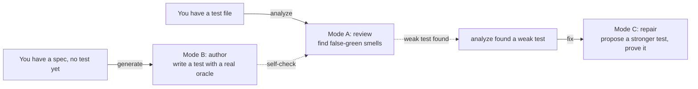
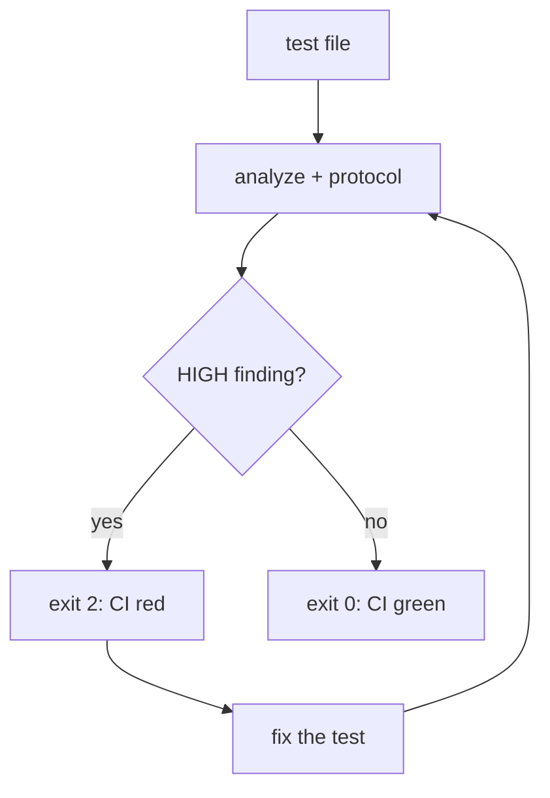
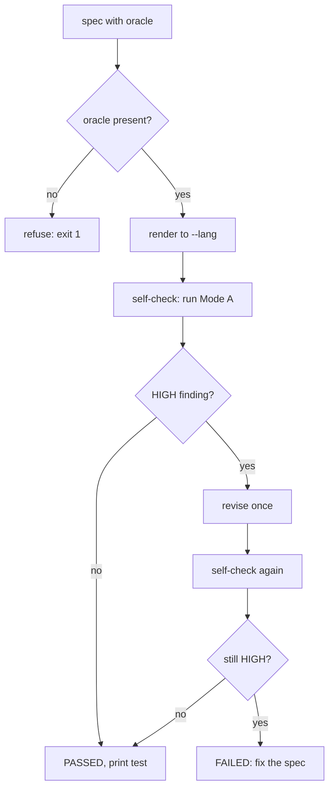

# User guide

This guide walks you through the three things falsegreen does, in the order most
people meet them: review a test you already have, write a new test that will not
lie to you, and repair a weak one. Each section is a runnable walkthrough, not a
feature list. Copy the commands, change the paths, and you are working.

If you only remember one thing: a test is false-green when it stays green while
the code it guards is broken. Everything here is about catching that, or avoiding
it in the first place.

## The three modes at a glance



One binary, three verbs. `analyze` judges a test, `generate` writes one, `fix`
repairs one. They share the same J1-J6 protocol, so a test `generate` writes is a
test `analyze` would pass, and a patch `fix` proposes is a test that has to survive
review before you trust it.

## Before you start

There are two ways to run falsegreen, and which one fits depends on how you already work.

### A) Inside your agent, on your login (no API key)

If you already use Claude Code, Codex CLI, Antigravity CLI, or Cursor - often on a Pro/Plus/Advanced
plan - install falsegreen there and it runs on the host's own model, using your logged-in session.
No API key, nothing to export, no per-token cost beyond your existing plan. This is what most
people on those tools want.

Enable it once, per host:

- **Claude Code:** `/plugin marketplace add vinicq/falsegreen-skill` then
  `/plugin install falsegreen-skill@falsegreen`
- **Codex CLI:** clone the repo and run `codex` - the root `AGENTS.md` auto-loads
  (the plugin marketplace path is not supported for this repo yet; see `contexts/codex.md`)
- **Antigravity CLI (`agy`):** `agy plugin install https://github.com/vinicq/falsegreen-skill`, or open the repo and `agy` discovers the workspace skill at `.agents/skills/falsegreen-skill/SKILL.md` (from Gemini CLI: `agy plugin import gemini`)
- **Cursor:** copy `contexts/cursor.md` into `.cursor/rules/falsegreen-skill.mdc`

Then attach a test and ask for analysis, or ask it to write a test for your feature. The same
analyze / generate / fix flows in this guide work; you talk to your agent instead of running a
command. Per-host detail is in [invocation-methods.md](invocation-methods.md).

### B) Standalone CLI, with your own API key (pay-per-token)

For CI, scripts, or when you are not inside a host. Needs Node 18 or newer and a provider API key.
The CLI ships with zero npm dependencies, so there is nothing to build.

```bash
# run it once without installing
npx falsegreen-skill --help

# or install it globally
npm install -g falsegreen-skill
```

Pick a provider and export its key. Anthropic is the default, so the shortest path
is one variable:

```bash
export ANTHROPIC_API_KEY=sk-ant-...
```

Any OpenAI-compatible host works too (Groq, OpenRouter, Ollama, and others). The
full table of base URLs and models lives in [cli.md](cli.md#openai-compatible-providers).
One caveat that trips people up: the protocol prompt is about 33k tokens, so a
provider whose free tier caps tokens per minute will reject the request. If you hit
an HTTP 413 or 429, that is why. Run Ollama locally or use a host with a larger tier.
Path A uses whatever model your agent is already logged into, so the provider keys here do not
apply to it.

## Mode A: review a test you already have

This is the one you reach for first. You have a test suite, it is green, and you
want to know which of those green checks would survive the code going wrong.

### Step 1 - point it at a test file

```bash
falsegreen-skill analyze tests/test_payment.py
```

The CLI reads the file, sends it with the protocol, and prints a report: each
finding carries a catalog code (like C5 or C20), the judgment it failed (J1-J6),
a confidence level, and a one-line fix hint. Clean tests get no finding.

### Step 2 - read the confidence, not just the count

HIGH means the reviewer is confident the test is false-green. LOW means it looks
suspicious but could be intentional. Start with the HIGH findings; they are the
ones that will bite you.

### Step 3 - wire it into CI

For a pipeline, ask for JSON and let the exit code do the gating:

```bash
falsegreen-skill analyze tests/test_payment.py tests/test_orders.py \
  --json --fail-on-high > report.json
```

Exit code 2 means at least one HIGH finding. Exit 1 means the model returned
something that did not match the schema. Exit 0 means you are clear. The GitHub
Actions snippet is in [cli.md](cli.md#ci-usage).



## Mode B: write a test that cannot lie

Ask any model to "write a test for this function" and it reads what the code
returns today and asserts that. The test passes, and it will keep passing even
after a bug changes what the code should return. That is a characterization test:
green by construction, useless as a guard.

Mode B refuses to do that. It takes the expected value from an oracle you supply,
not from the code, and then it reviews its own output before handing it back.

### Step 1 - write the spec, oracle included

The spec is a small YAML (or JSON) file. The shape is in
[`schema/test-spec.json`](../schema/test-spec.json); here is the shipped example:

```yaml
level: unit
unit: apply_discount(price, rate)
scenario: a 15% discount on 200 returns 170
arrange:
  - price = 200
  - rate = 0.15
act: result = apply_discount(200, 0.15)
oracle:
  source: spec
  expected: "170 (200 minus 15% = 200 - 30)"
doubles: []
```

The `oracle` block is the whole point. `expected: 170` comes from the spec ("15%
off 200"), not from running `apply_discount` and copying the answer. Leave the
oracle out and the command stops before it calls the model, because a test with no
independent oracle is exactly the false-green it exists to prevent.

### Step 2 - render it into a language

```bash
falsegreen-skill generate examples/authoring/apply-discount.spec.yaml --lang python
```

You get a real Python test with the expected value traced back to the spec. Want
the same behavior in TypeScript? Same spec, different flag:

```bash
falsegreen-skill generate examples/authoring/apply-discount.spec.yaml --lang typescript
```

One language per run. The spec is the single source, so re-running keeps the four
stacks equivalent instead of drifting apart.

### Step 3 - read the self-check line

After writing the test, the CLI runs Mode A on it. Three outcomes:

- **PASSED (exit 0)** - the generated test tripped no HIGH false-green finding. Use it.
- **FAILED (exit 1)** - the test still looks false-green; the CLI already revised once and
  it did not clear. Usually the spec's oracle is too weak. Tighten it and re-run.
- **UNVERIFIED (exit 3)** - the model could not produce a valid review report (common on
  small models). The test is still printed, but it is not accepted, so a pipeline
  never treats an unchecked test as clean. Try a stronger model for the self-check.

The self-check is a same-model static review, not an execution: it does not run
the test, confirm it compiles or imports, or verify the oracle value.



The honest limit: the self-check proves the test is not obviously false-green. It
does not prove your oracle value is right. If you tell the spec that 15% off 200 is
150, you get a confident, well-formed, wrong test. The oracle is yours to get right.

### Author tests for the feature you're building

The `apply_discount` walkthrough is just the shape. The same flow works for whatever you are
actually building: a TypeScript service, a React component, an API endpoint. You describe the unit
and, crucially, the oracle (the expected result and where it comes from), and the skill writes the
test. There are two paths.

**In an editor host (Claude Code, Cursor, Gemini).** Ask in natural language. No spec file:

> write a unit test for `applyPromo(cart, code)` in TypeScript; a valid code takes 10% off the
> subtotal, per the pricing spec

The host elicits the level and oracle if you left them out, renders the test, and runs the same
self-check. If you never name where the expected value comes from, it asks, because a test with no
independent oracle is the false-green it refuses to write.

**On the CLI.** Put the same answers in a spec and pick the stack. A realistic feature spec:

```yaml
level: unit
unit: applyPromo(cart, code)
scenario: SAVE10 takes 10% off a 200 subtotal, per the pricing spec
languages: [TypeScript]
arrange:
  - cart = { subtotal: 200 }
  - code = "SAVE10"
act: result = applyPromo(cart, "SAVE10")
oracle:
  source: spec
  expected: "180 (200 minus 10% = 200 - 20), from the pricing spec"
doubles: []
```

```bash
falsegreen-skill generate promo.spec.yaml --lang typescript
```

You get a real TypeScript test whose expected `180` traces back to the pricing spec, not to what
`applyPromo` happens to return today.

The React side of the family works the same way. A component spec renders through Testing Library:

```bash
falsegreen-skill generate profile-card.spec.yaml --lang tsx
```

The rendered test imports its framework explicitly and asserts against the visible state
(`screen.getByRole(...)`), not the render call's return value, and it clears the self-check like
any other. `--lang jsx` does the same for plain-JS React.

That last point is the rule for anything above a pure function: the oracle for a component or an
end-to-end test is the visible state a user would see, not the internal output of the render. The
higher the level on the test pyramid, the more the oracle is "what the user observes."

## Mode C: repair a weak test and prove the repair

`analyze` found a false-green. `fix` proposes a stronger version and then proves it
before you trust it. It is opt-in, Python and pytest only for now, and it never
touches your production code or applies the patch itself.

### Step 1 - name the finding and the code it protects

```bash
falsegreen-skill fix tests/test_discount.py --case C2b --line 14 \
  --sut src/discount.py --sut-line 12
```

`--case` and `--line` come straight from the `analyze` report. `--sut` is the
production file the test is supposed to guard, and `--sut-line` is the behavior line
the finding is about.

### Step 2 - trust the gate, not the model

The CLI builds a clean copy of your code and runs three checks on the proposed
patch: it parses, it passes pytest against the real code, and it fails when a single
operator on the SUT line is flipped. A patch is accepted only when it passes on
correct code and goes red on the mutant. That last check is what separates a real
assertion from a fresh tautology.

Without `--sut` the gate cannot mutate anything, so it degrades to propose-only and
says the patch is unvalidated. Exit code is 0 on accept, 1 on reject or unvalidated,
so CI can branch on it.

The honest limit: the gate proves the patch catches that one mutant, not every bug
that could ever exist. It is a floor, not a guarantee.

## Choosing a provider

This section is about path B, the standalone CLI. Path A uses whatever model your agent is logged
into, so none of these keys apply there.

The three built-in providers each read their own key and need no `--base-url`. Every
command (`analyze`, `generate`, `fix`) takes the same flags, so switching provider is
one flag:

```bash
# Claude (Anthropic) - the default provider, nothing extra to pass
export ANTHROPIC_API_KEY=sk-ant-...
falsegreen-skill analyze tests/test_payment.py
falsegreen-skill generate promo.spec.yaml --lang typescript

# Codex (OpenAI) - GPT / o-series models
export OPENAI_API_KEY=sk-...
falsegreen-skill analyze tests/test_payment.py --provider openai --model gpt-5

# Gemini (Google)
export GEMINI_API_KEY=...
falsegreen-skill analyze tests/test_payment.py --provider gemini
```

Any other host that speaks the OpenAI Chat API works through `--provider openai-compatible`.
Point `--base-url` at the `/v1` root and pass the model id:

```bash
export FALSEGREEN_API_KEY=sk-or-...
falsegreen-skill analyze tests/test_payment.py \
  --provider openai-compatible \
  --base-url https://openrouter.ai/api/v1 \
  --model meta-llama/llama-3.3-70b-instruct --max-tokens 8192
```

The provider table in [cli.md](cli.md#openai-compatible-providers) lists base URLs,
example models, and whether each free tier fits the 33k prompt. For running the
skill without your own key at all, install it as an editor plugin and let the host
model do the work; see [invocation-methods.md](invocation-methods.md).

## When something goes wrong

| Symptom | Cause | What to do |
|---|---|---|
| HTTP 413 or 429 right away | The 33k prompt exceeds the provider's free per-minute token cap | Use a larger tier, a big-context model, or Ollama locally |
| `generate` says UNVERIFIED | The model could not emit a valid review report | Use a stronger model for the self-check |
| JSON output "could not parse" | A reasoning model spent its budget on thinking and got cut off | Raise `--max-tokens` to 8192 or higher |
| `generate` refuses before any call | The spec has no `oracle.expected`, or `--lang` is unknown | Add the oracle block, or fix the language flag |
| `fix` says "unvalidated" | You did not pass `--sut` / `--sut-line` | Pass both so the mutation gate can run |

## Where to go next

- [cli.md](cli.md) - every flag, every command, the full provider table
- [invocation-methods.md](invocation-methods.md) - CLI, API token, editor plugin, CI
- [SKILL.md](../SKILL.md) - the J1-J6 protocol itself
- [architecture.md](architecture.md) - how the pieces fit together
